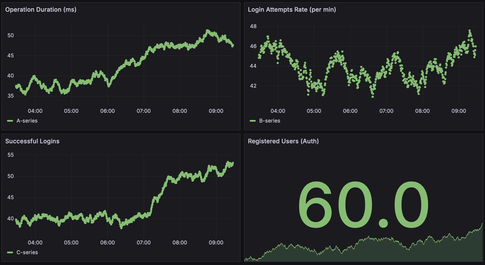
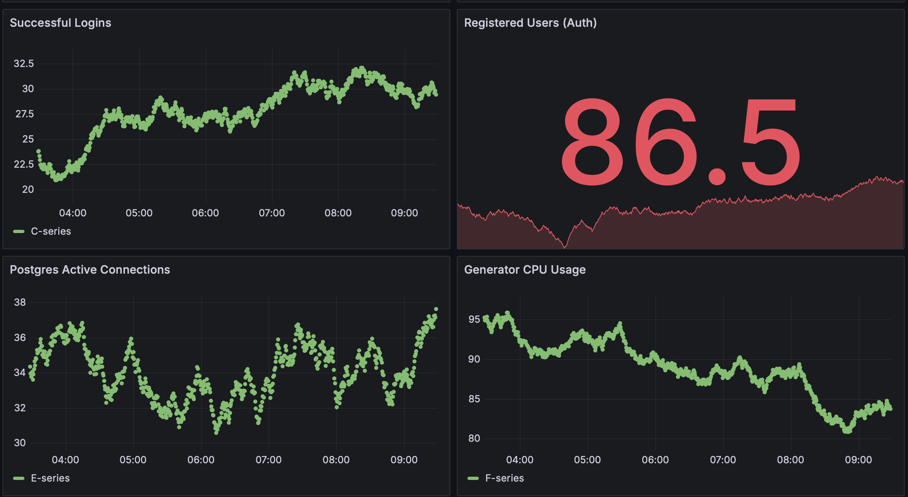
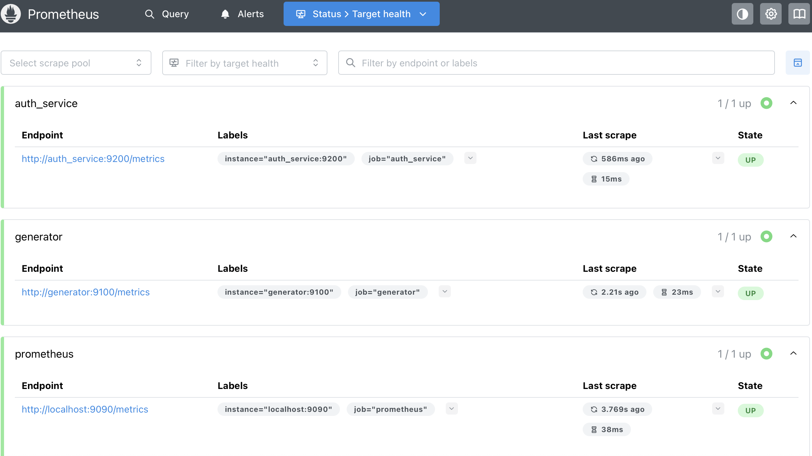

# Database Monitoring Project

Моніторингова система, побудована на Docker, що об’єднує **PostgreSQL**, **Prometheus**, **Grafana**, **Flask Auth Service** і **Data Generator**.  
Проєкт дозволяє в реальному часі **збирати, аналізувати та візуалізувати метрики** з усіх сервісів.

---

##  Архітектура

```

┌──────────────────────────────────────────┐
│             Grafana (3030)               │
│     └── підключена до Prometheus ────────┤
│             ↑                            │
│        Prometheus (9099)                 │
│     ├── збирає метрики з:                │
│     │   • generator:9100                 │
│     │   • auth_service:9200              │
│     │   • postgres_db                    │
│             ↑                            │
│        Data Generator                    │
│     └── записує дані в PostgreSQL        │
│             ↑                            │
│        PostgreSQL (5434)                 │
└──────────────────────────────────────────┘

```

---

##  Структура проєкту

```

db-monitoring-project/
├── auth_service/
│   ├── Dockerfile.auth
│   ├── auth_server.py
│   └── users.db
│
├── data_generator/
│   ├── Dockerfile.generator
│   └── generator.py
│
├── grafana/
│   └── provisioning/
│       ├── dashboards/
│       │   └── db_monitoring_dashboard.json
│       └── datasources/
│           └── datasource.yml
│
├── prometheus/
│   └── prometheus.yml
│
├── docker/
│   └── docker-compose.yml
│
├── tools/
│   └── traffic_simulator.py
│
└── README.md

````

---

##  Використані технології

| Компонент | Опис |
|------------|------|
| **Python + Flask** | REST API для Auth Service |
| **PostgreSQL** | Зберігання даних |
| **Prometheus** | Збір метрик |
| **Grafana** | Візуалізація показників |
| **Docker Compose** | Оркестрація контейнерів |
| **Prometheus Client Library** | Експорт метрик з Python |

---

## Запуск

```bash
# Клонування репозиторію
git clone https://github.com/yourusername/db-monitoring-project.git
cd db-monitoring-project/docker

# Запуск контейнерів
docker compose up -d --build

# Перевірка запущених контейнерів
docker ps --format "table {{.Names}}\t{{.Ports}}"

# Зупинка контейнерів
docker compose down
````

**Порти сервісів:**

| Сервіс       | Порт        | Призначення         |
| ------------ | ----------- | ------------------- |
| Grafana      | 3030        | Інтерфейс дашбордів |
| Prometheus   | 9099        | Збір метрик         |
| Generator    | 9100        | Метрики операцій    |
| Auth Service | 5005 / 9200 | API та метрики      |
| PostgreSQL   | 5434        | Сховище даних       |

---

## Основні Endpoints

| Endpoint                        | Опис                      |
| ------------------------------- | ------------------------- |
| `http://localhost:9100/metrics` | Метрики Data Generator    |
| `http://localhost:9200/metrics` | Метрики Auth Service      |
| `http://localhost:9099/targets` | Список Prometheus targets |
| `http://localhost:3030`         | Веб-інтерфейс Grafana     |
| `http://localhost:5005/login`   | Flask API авторизації     |

---

## Конфігурація Prometheus

```yaml
global:
  scrape_interval: 5s

scrape_configs:
  - job_name: "prometheus"
    static_configs:
      - targets: ["localhost:9090"]

  - job_name: "generator"
    static_configs:
      - targets: ["generator:9100"]

  - job_name: "auth_service"
    static_configs:
      - targets: ["auth_service:9200"]
```

---

## Grafana Dashboard

**Назва:** `Project Monitoring Dashboard`
**Оновлення:** кожні 5 секунд

### Відображає:

* ⏱ **operation_duration_ms** — середня тривалість операцій
* 🔐 **auth_login_attempts_total** — кількість спроб логіну
* ✅ **auth_successful_logins_total** — успішні входи
* 👥 **auth_registered_users_total** — зареєстровані користувачі
* 💾 **pg_stat_activity_count** — активні з’єднання PostgreSQL
* ⚙️ **process_cpu_seconds_total** — CPU генератора

---

##  Screenshots





```


---

## Виконані умови

✅ Контейнери PostgreSQL, Prometheus, Grafana, Auth Service, Generator
✅ Prometheus збирає всі метрики
✅ Grafana показує 4+ графіки у дашборді
✅ Дані оновлюються в реальному часі
✅ Моніторинг охоплює логіни, користувачів, операції та стан БД

---

**Автор:** *Diana Velycho*
**Рік:** 2025

