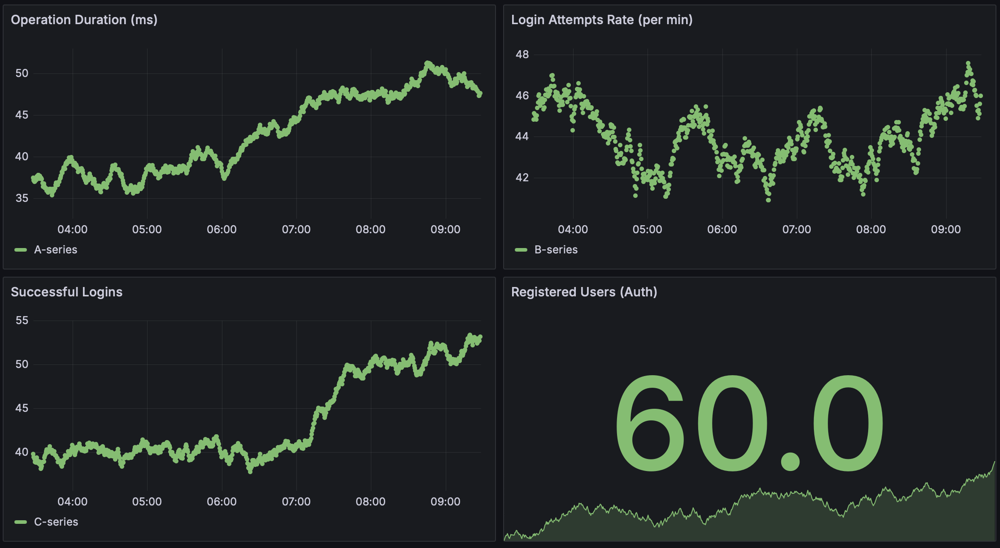
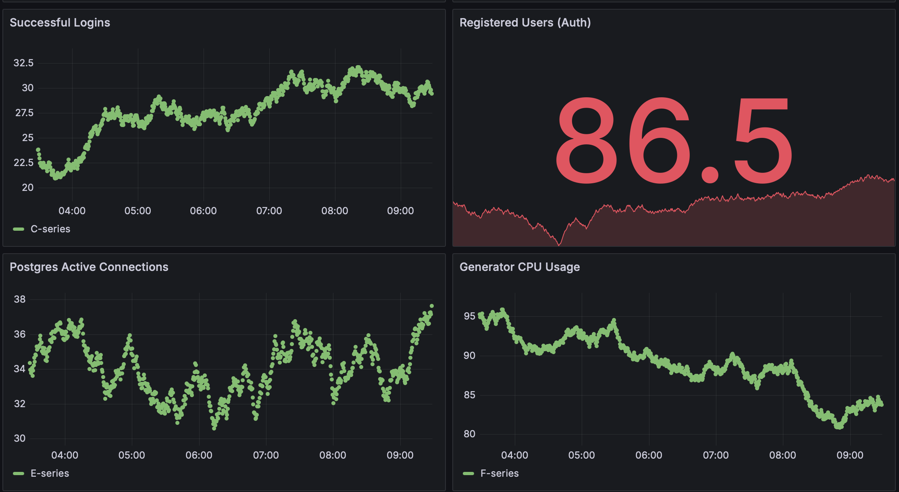
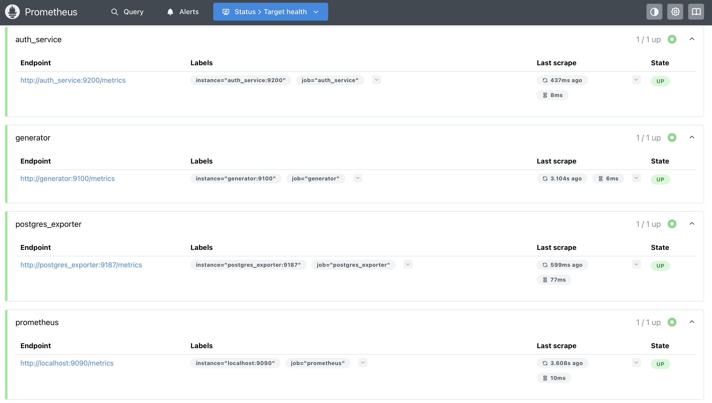

# Database Monitoring Project

Моніторингова система, побудована на Docker, що об’єднує **PostgreSQL**, **Postgres Exporter**, **Prometheus**, **Grafana**, **Flask Auth Service** і **Data Generator**.
Проєкт дозволяє в режимі реального часу **збирати, аналізувати та візуалізувати метрики** з усіх сервісів — бази даних, сервісу авторизації, генератора даних та системного рівня.

---

## Архітектура

```
┌───────────────────────────────────────────────┐
│                   Grafana (3030)              │
│                 └── dashboard                 │
│                         ↑                     │
│                Prometheus (9099)              │
│        ┌───────────────┼──────────────────┐   │
│        │               │                  │   │
│ generator:9100   auth_service:9200   postgres_exporter:9187
│   ↑ (insert)             ↑ (login)              ↑ (DB metrics)
│                      Auth Service (5005)        │
│                           ↑                     │
│                     PostgreSQL (5434)           │
└───────────────────────────────────────────────┘
```

---

## Структура проєкту

```
db-monitoring-project/
├── auth_service/
│   ├── Dockerfile.auth
│   ├── auth_server.py
│   └── users.db
│
├── data_generator/
│   ├── Dockerfile.generator
│   └── generator.py
│
├── grafana/
│   └── provisioning/
│       ├── dashboards/
│       │   └── project_dashboard.json
│       └── datasources/
│           └── datasource.yml
│
├── prometheus/
│   └── prometheus.yml
│
├── postgres/
│   └── init.sql
│
├── docker/
│   └── docker-compose.yml
│
├── tools/
│   └── traffic_simulator.py
│
└── README.md
```

---

##  Використані технології

| Компонент                    | Опис                      |
| ---------------------------- | ------------------------- |
| **Python + Flask**           | Реалізація Auth Service   |
| **PostgreSQL**               | Основна база даних        |
| **Postgres Exporter**        | Метрики Postgres          |
| **Prometheus**               | Збір та агрегація метрик  |
| **Grafana**                  | Візуалізація              |
| **Docker Compose**           | Оркестрація               |
| **Prometheus Python Client** | Експорт метрик з сервісів |

---

## Запуск

###  Клонувати репозиторій

```bash
git clone https://github.com/yourusername/db-monitoring-project.git
cd db-monitoring-project/docker
```

### Запустити весь стек

```bash
docker compose up -d --build
```

### Перевірити статус

```bash
docker ps --format "table {{.Names}}\t{{.Ports}}"
```

### Зупинити

```bash
docker compose down
```

---

##  Порти сервісів

| Сервіс            | Порт            | Значення           |
| ----------------- | --------------- | ------------------ |
| Grafana           | **3030**        | Панель моніторингу |
| Prometheus        | **9099**        | Метрики            |
| Generator         | **9100**        | Метрики генератора |
| Auth Service      | **5005 / 9200** | API та метрики     |
| Postgres          | **5434**        | База даних         |
| Postgres Exporter | **9187**        | Метрики PostgreSQL |

---

##  Основні Endpoints

| Endpoint                         | Опис                   |
| -------------------------------- | ---------------------- |
| `http://localhost:9100/metrics`  | Метрики Data Generator |
| `http://localhost:9200/metrics`  | Метрики Auth Service   |
| `http://localhost:9187/metrics`  | Метрики PostgreSQL     |
| `http://localhost:9099/targets`  | Target-стан Prometheus |
| `http://localhost:3030`          | Grafana                |
| `http://localhost:5005/register` | Реєстрація             |
| `http://localhost:5005/login`    | Авторизація            |

---

##  Конфігурація Prometheus

```yaml
global:
  scrape_interval: 5s

scrape_configs:
  - job_name: "prometheus"
    static_configs:
      - targets: ["localhost:9090"]

  - job_name: "generator"
    static_configs:
      - targets: ["generator:9100"]

  - job_name: "auth_service"
    static_configs:
      - targets: ["auth_service:9200"]

  - job_name: "postgres_exporter"
    static_configs:
      - targets: ["postgres_exporter:9187"]
```

---

##  Grafana Dashboard

**Назва:** `Project Monitoring Dashboard`
**Оновлення:** кожні 5 секунд

### Відображає метрики:

###  Data Generator

* `operation_duration_ms`
* histogram `operation_duration_hist_ms`
* `operations_total`
* `db_table_size_bytes`

###  Auth Service

* `auth_registered_users_total`
* `auth_login_attempts_total`
* `auth_successful_logins_total`

###  PostgreSQL

* `pg_stat_activity_count`
* `pg_database_size`

###  System

* CPU generator (`process_cpu_seconds_total`)
* Memory usage

---

##  Traffic Simulator

Для генерації навантаження:

```bash
cd db-monitoring-project
python3 tools/traffic_simulator.py --duration 20 --users 50 --threads 10
```

Simulator:

* створює користувачів через `/register`
* виконує паралельні логіни через `/login`
* додає інформації на графіки Grafana

---

## Screenshots







---

##  Виконані вимоги

* Контейнери **PostgreSQL, Prometheus, Grafana, Generator, Auth Service**
* Метрики з усіх компонентів успішно збираються
* Створений **великий Grafana Dashboard** з 6+ графіками
* Дані оновлюються в реальному часі
* Присутній **Traffic Simulator**
* Реєстрація та логіни генерують навантаження
* Метрики коректно відображаються в Grafana

---

##  Автор

**Diana Velycho**
2025

---
